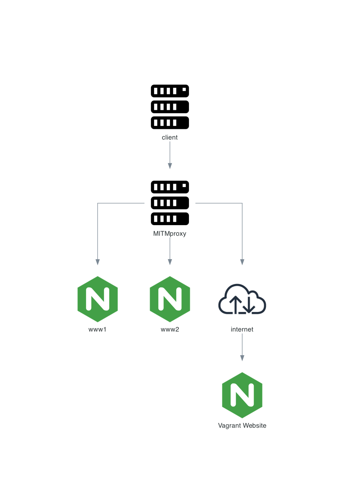

# Proxy-SSL lab

In this exercise from kikitux you will test the mitmproxy server with the following diagram

    

# Client machine

```
vagrant ssh client
```

## test proxy
```
curl -v https://www1.test.kikitux.net --proxy http://192.168.56.10:8080
curl -v https://www2.test.kikitux.net --proxy http://192.168.56.10:8080
```
Error: curl: (60) SSL certificate problem: self signed certificate in certificate chain  
Answer: fails because we don't have the Certificate bundle for the proxy server

## with proxy variable
```
export HTTP_PROXY=http://192.168.56.10:8080
export HTTPS_PROXY=http://192.168.56.10:8080
curl -v https://www1.test.kikitux.net
curl -v https://www2.test.kikitux.net
```
Error: curl: (60) SSL certificate problem: self signed certificate in certificate chain  
Answer: fails because we don't have the Certificate bundle for the proxy server  
```
export CURL_CA_BUNDLE=/home/vagrant/cert.pem
curl -v https://www1.test.kikitux.net
curl -v https://www2.test.kikitux.net
```
Error: Certificate verification error for www1.test.kikitux.net: certificate has expired   
Answer: Certificate isn't valid anymore. Expired on September 29, 2021  
```
openssl x509 -in /vagrant/conf/test.kikitux.net/chain.pem -text -noout
    Data:
        Version: 3 (0x2)
        Serial Number:
            40:01:75:04:83:14:a4:c8:21:8c:84:a9:0c:16:cd:df
        Signature Algorithm: sha256WithRSAEncryption
        Issuer: O = Digital Signature Trust Co., CN = DST Root CA X3
        Validity
            Not Before: Oct  7 19:21:40 2020 GMT
            Not After : Sep 29 19:21:40 2021 GMT                         <-- Not valid anymore
```

## test vagrant over proxy

This should fail, as vagrant wont trust the proxy certificate  
```
unset CURL_CA_BUNDLE
mkdir -p ~/test
cd ~/test
. ~/proxy.env
env | grep -i proxy
vagrant box add hashicorp/bionic64
```
Answer: It doesn't work if you make sure you unset the CURL_CA_BUNDLE after the former test  

## test vagrant over proxy using proxy cert
this should work, as vagrant will now trust the proxy certificate
```
mkdir -p ~/test
cd ~/test
. ~/proxy.env
env | grep -i proxy
export CURL_CA_BUNDLE=/home/vagrant/cert.pem
vagrant box add hashicorp/bionic64
unset CURL_CA_BUNDLE
```
Answer: It works now  